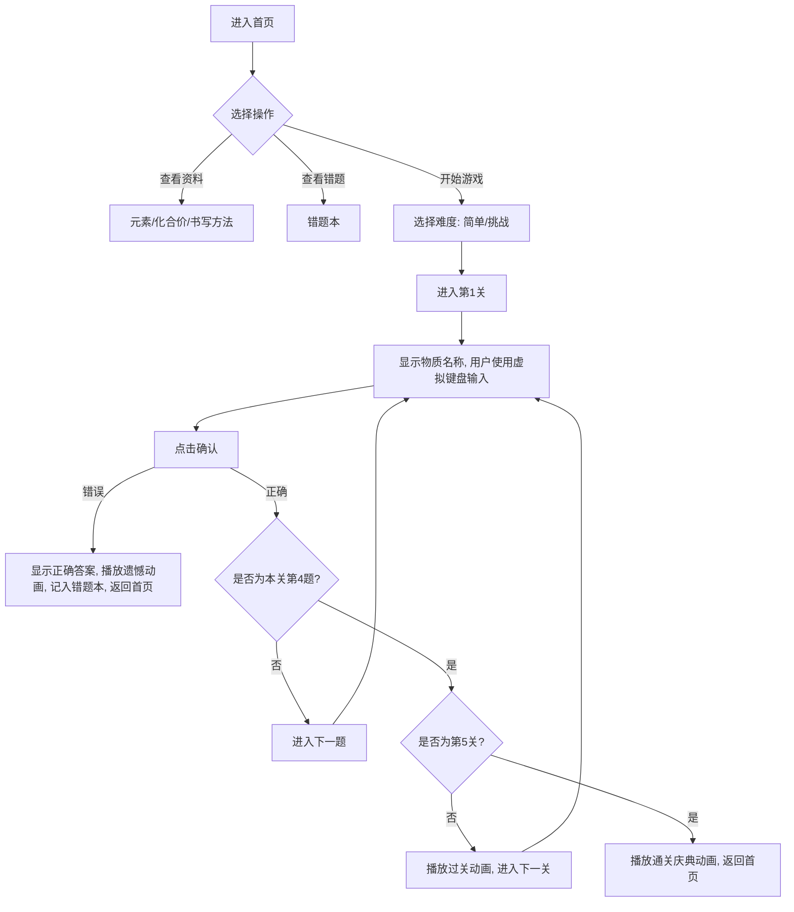

## 1. 产品概述
这是一款专为初中生设计的“化学式书写闯关游戏”。
- 旨在通过游戏化的方式，帮助初中生熟练掌握简单和复杂化学式的书写规则。
- 结合精美的UI设计、丰富的音效与动画反馈，提升学习兴趣与记忆效果。

## 2. 核心功能
### 2.1 核心模块
1. **首页模块**：展示精美的海报级背景，提供开始游戏（写化学式）、元素介绍、化合价介绍、化学式书写方法、错题本等入口。
2. **游戏关卡模块**：分为“简单”和“挑战”两个难度等级。每个等级包含5关，每关4个化学式书写任务。
3. **交互键盘模块**：专为化学式定制的虚拟键盘，包含元素符、原子团、下标数字及括号，禁用系统默认键盘。
4. **错题本模块**：记录用户书写错误的化学式，使用浏览器本地存储（LocalStorage）保存。
5. **反馈与动画模块**：包含按键音效、正确/错误提示音、过关粒子动画及通关庆典动画。

### 2.2 页面详细描述
| 页面名称 | 模块名称 | 功能描述 |
|-----------|-------------|---------------------|
| 首页 | 导航与入口 | 提供游戏模式选择、学习资料查看（PPT/弹窗形式）和错题本入口。 |
| 难度选择页 | 模式选择 | 提供“简单”和“挑战”两个难度等级的入口。 |
| 游戏主界面 | 答题区域 | 顶部显示物质名称，中间为输入框（支持下标和原子团整体显示），底部为定制虚拟键盘及操作按钮。 |
| 错题本页 | 错题列表 | 展示历史答错的化学式，支持清理。 |

## 3. 核心流程
用户进入游戏后，可先查阅基础知识，或直接选择难度开始挑战。在答题过程中，通过点击专属虚拟键盘输入化学式。系统实时判断对错，并在关卡完成或失败时给予动画反馈，错题自动记入错题本。

## 4. 用户界面设计
### 4.1 设计风格
- **主色调**：海报紫蓝色调（科技感与神秘感）。
- **按钮样式**：毛玻璃拟态按钮（半透明渐变 + 模糊效果 + 发光边框），现代大圆角（25px）。
- **交互反馈**：悬停时上浮 + 缩放 + 阴影加深；悬停时光线从左到右扫过。
- **立体阴影**：多层阴影 + 内阴影，增强质感。
- **背景设计**：动态背景（旋转的径向渐变动画），彩色装饰（紫色渐变边框）。

### 4.2 页面设计概览
| 页面名称 | 模块名称 | UI元素及风格 |
|-----------|-------------|-------------|
| 首页 | 标题与背景 | 超大醒目标题带底部装饰条，动态背景，毛玻璃卡片式布局。 |
| 游戏主界面 | 答题区与键盘 | 元素大小自适应屏幕，数字呈下标样式，原子团作为一个整体显示。确保所有内容在同一屏内。 |

### 4.3 响应式设计
- 采用响应式布局，确保在手机和电脑上都能获得良好体验。
- 移动端优先适配，虚拟键盘按键大小适中，防止误触，禁用原生键盘唤起。
