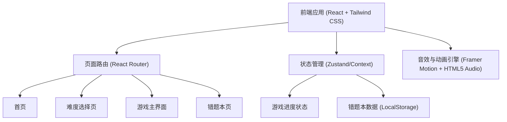

## 1. 架构设计



## 2. 技术说明
- **前端框架**：React@18 + vite
- **样式方案**：Tailwind CSS (用于快速实现复杂的毛玻璃、渐变、阴影等UI效果)
- **图标与动画**：Lucide React, Framer Motion, canvas-confetti (用于过关庆典粒子动画)
- **状态管理**：Zustand (管理当前关卡、题目、错题等状态)
- **音频处理**：原生 HTML5 Audio API (使用系统生成的 Base64 简单音效或开源音频资源)
- **存储方案**：浏览器 LocalStorage (用于持久化保存错题本数据)

## 3. 路由定义
| 路由 | 用途 |
|-------|---------|
| `/` | 游戏首页，展示主菜单、资料入口 |
| `/level-select` | 难度选择页面 |
| `/game/:difficulty` | 游戏主界面，`difficulty` 为 `simple` 或 `challenge` |
| `/mistakes` | 错题本页面 |

## 4. 核心数据模型

### 4.1 数据结构定义

```typescript
// 化学式题目类型
interface Question {
  name: string;      // 物质名称，如 "水"
  formula: string;   // 化学式，如 "H2O"
}

// 错题记录类型
interface MistakeRecord {
  name: string;
  formula: string;
  userAnswer: string;
  timestamp: number;
}
```

## 5. 核心工具函数
- `parseFormula(formula: string)`: 自动解析化学式，支持普通元素、原子团及括号结构，将其转化为可渲染的富文本格式（如处理数字下标）。此函数会将输入的化学式（如 H2O）拆分为元素和数字的组合，以便在界面上正确显示下标样式，同时在挑战模式中对原子团进行整体处理。
